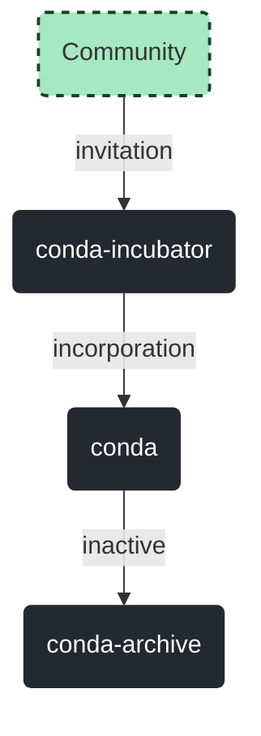

# The conda Organization
Conda is an open-source organization and the community behind the [conda](https://github.com/conda/conda) package manager.

The conda community is composed of three organizations here on GitHub:
- [conda](https://github.com/conda): where officially supported projects live
- [conda-incubator](https://github.com/conda-incubator): where community incubated projects live
- [conda-archive](https://github.com/conda-archive): where inactive and archived projects live

The flowchart below explains how projects move within these organizations:

Note that projects may also be directly added to the conda organization upon request to the steering council. For more details please read [Incorporate a Software Project into the main conda Organization](https://github.com/conda-incubator/governance#incorporate-a-software-project-into-the-main-conda-organization).

### Important Repositories

- [conda](https://github.com/conda/conda)
- [conda-build](https://github.com/conda/conda-build)

### Important Community Places

- [Governance](https://github.com/conda-incubator/governance): outlines and defines how the conda community works
- [CEPs](https://github.com/conda-incubator/ceps): Conda Enhancement Proposals
- [Discourse](https://conda.discourse.group/): conda community discussion forum
- [Twitter](https://twitter.com/condaproject): for the latest developments

---

All interactions within the conda Organization are governed by our [Code of Conduct](https://github.com/conda-incubator/governance/blob/main/CODE_OF_CONDUCT.md#the-short-version).
